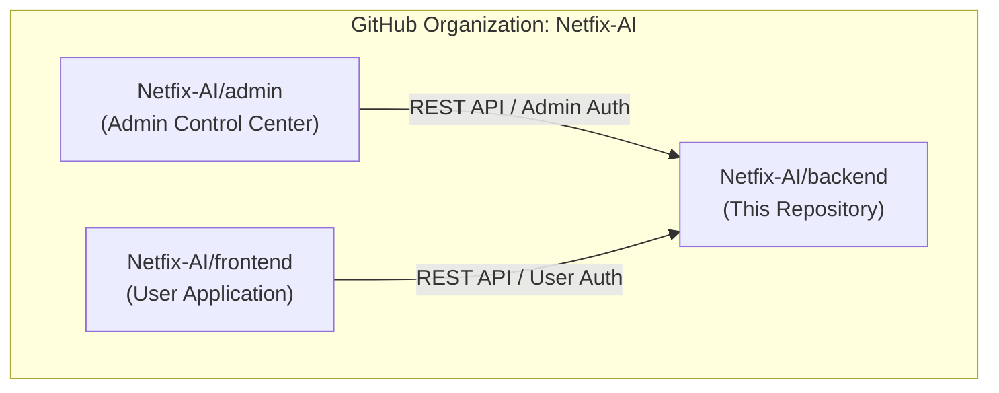
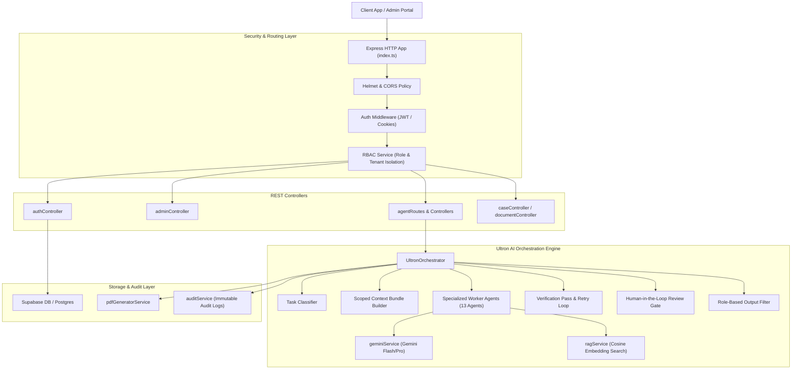
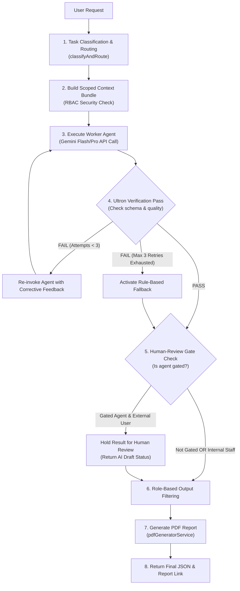

# NETFIX AI — Backend

[](LICENSE)
[](https://nodejs.org/)
[](https://www.typescriptlang.org/)
[](https://expressjs.com/)
[](https://aistudio.google.com/)
[](https://supabase.com/)

The **NETFIX AI Backend** is the core API server, security enforcement layer, and AI orchestration engine powering the NETFIX AI platform (developed in association with MARG GROUP). It combines strict multi-tenant Role-Based Access Control (RBAC), multi-factor admin authentication, Retrieval-Augmented Generation (RAG), and the **Ultron AI Agent Orchestrator** running Google Gemini Flash/Pro models with automated self-correction verification and human-in-the-loop governance.

---

## 📌 Repository Scope

> [!IMPORTANT]
> This repository contains **ONLY** the backend REST API, database access layer, and AI orchestration logic.
>
> It does **not** contain the admin frontend portal or user-facing web application.
>
> The corresponding frontend repositories are maintained separately:
> - **Admin Control Center**: [`Netfix-AI/admin`](https://github.com/Netfix-AI/admin)
> - **User-Facing Frontend**: [`Netfix-AI/frontend`](https://github.com/Netfix-AI/frontend)



---

## 🛠️ Technology Stack

- **Runtime & Language**: Node.js (`>=18.0.0`), TypeScript 5.8 (`tsx`, `typescript`)
- **Web Framework**: Express 4 (`express`)
- **AI & LLM Integration**:
  - Google Generative AI SDK (`@google/generative-ai`)
  - Models: Gemini 1.5 Flash (Fast inference), Gemini 1.5 Pro (Deep reasoning)
- **Database & Data Layer**:
  - Supabase JS Client (`@supabase/supabase-js`)
  - PostgreSQL client (`pg`, `@types/pg`)
- **Security & Middleware**:
  - JSON Web Tokens (`jsonwebtoken`)
  - Bcrypt Password Hashing (`bcryptjs`)
  - Security Headers (`helmet`)
  - Cross-Origin Resource Sharing (`cors`)
  - Cookie Parser (`cookie-parser`)
  - Rate Limiting (`express-rate-limit`)
- **Utilities & PDF Generation**:
  - PDF Report Generator (`pdfkit`, `@types/pdfkit`)
  - OTP & MFA Utilities (`qrcode`, `@types/qrcode`)
  - Environment Config (`dotenv`)

---

## 🏗️ Backend System Architecture



---

## 📂 Complete Project Structure

```
backend/
├── migrations/
│   ├── 001_initial_schema.sql         # Base database schema tables
│   ├── 002_mfa_support.sql            # Multi-factor auth schema
│   ├── 003_audit_trail.sql            # Security audit trail logging schema
│   ├── 004_ai_agent_infrastructure.sql # Agent tasks, reports, RAG tables
│   ├── 005_additional_phase1_tables.sql # Phase 1 foundation entities
│   └── 006_domain_intelligence.sql     # Domain intelligence module schemas
├── src/
│   ├── controllers/                   # REST HTTP Request Controllers
│   │   ├── adminAuthController.ts
│   │   ├── adminController.ts
│   │   ├── advancedAnalysisController.ts
│   │   ├── advocateController.ts
│   │   ├── authController.ts
│   │   ├── caseController.ts
│   │   ├── clientController.ts
│   │   ├── clientPortalController.ts
│   │   ├── documentController.ts
│   │   ├── domainIntelligenceController.ts
│   │   ├── entityController.ts
│   │   ├── ocrController.ts
│   │   ├── queryController.ts
│   │   └── rbacController.ts
│   ├── middleware/                    # Security & Authentication Middlewares
│   │   └── authMiddleware.ts
│   ├── routes/                        # Express API Endpoint Route Definitions
│   │   ├── adminRoutes.ts
│   │   ├── advancedAnalysisRoutes.ts
│   │   ├── advocateRoutes.ts
│   │   ├── agentRoutes.ts
│   │   ├── auditorRoutes.ts
│   │   ├── authRoutes.ts
│   │   ├── caseRoutes.ts
│   │   ├── clientPortalRoutes.ts
│   │   ├── clientRoutes.ts
│   │   ├── documentRoutes.ts
│   │   ├── domainIntelligenceRoutes.ts
│   │   ├── entityRoutes.ts
│   │   ├── ocrRoutes.ts
│   │   ├── queryRoutes.ts
│   │   └── rbacRoutes.ts
│   ├── services/                      # Business Logic, AI, and Integration Services
│   │   ├── auditService.ts
│   │   ├── brevoService.ts
│   │   ├── encryptionUtility.ts
│   │   ├── geminiService.ts
│   │   ├── healthService.ts
│   │   ├── otpService.ts
│   │   ├── pdfGeneratorService.ts
│   │   ├── ragService.ts
│   │   ├── rbacService.ts
│   │   ├── supabaseService.ts
│   │   └── ultronOrchestrator.ts
│   ├── tests/                         # Security & Integration Test Suites
│   │   ├── aiPhase1Tests.ts - aiPhase14Tests.ts
│   │   └── phase1SecurityTests.ts - phase3SecurityTests.ts
│   ├── types/
│   │   └── index.ts                   # Backend TypeScript interfaces and schemas
│   └── index.ts                       # Server entry point & Express bootstrap
├── .env.example                       # Safe environment variable configuration template
├── .gitignore                         # Git exclusion rules
├── package.json                       # Dependencies & scripts
└── tsconfig.json                      # TypeScript configuration
```

---

## 🤖 AI Agent Architecture & Ultron Engine

The AI Intelligence Layer is governed by the **`UltronOrchestrator`** service ([`src/services/ultronOrchestrator.ts`](file:///d:/TEJA%20PERSONAL/Nushift/Project%20M/Project/backend/src/services/ultronOrchestrator.ts)).

### Implemented Specialized AI Agents

Every agent is registered in the orchestrator pool and backed by Gemini model reasoning or deterministic domain engines:

| Agent Key | Agent Name | Location | Purpose | Input | Processing Model | Output | Called By / Endpoint |
|-----------|------------|----------|---------|-------|------------------|--------|----------------------|
| `ultron` | Ultron Super-Admin Orchestrator | `ultronOrchestrator.ts` | Task classification, routing, RBAC context scoping, verification | User task description | Gemini 1.5 Pro | Classification JSON & Agent Routing | `POST /api/agent/test-orchestrator` |
| `doc_intake` | Document Intelligence Agent | `ultronOrchestrator.ts` | Document classification, OCR field extraction, confidence scoring | Uploaded document, case ID | Gemini 1.5 Flash / Rule Fallback | Extracted fields (GSTIN, dates, amounts), confidence score | `POST /api/agent/doc-intake` |
| `case_analysis` | Case Intelligence Agent | `ultronOrchestrator.ts` | Fact synthesis, timeline construction, contradiction detection | Case ID, facts, evidence | Gemini 1.5 Pro | Fact summary, timeline events, contradiction list | `POST /api/agent/case-analysis` |
| `tax_intelligence` | Tax & GST Intelligence Agent | `ultronOrchestrator.ts` | Income Tax & GST calculations, GSTR-3B reconciliation, mismatch detection | Filing data, tax regime, AY | Gemini 1.5 Pro | Computed tax liabilities, ITC mismatches, penalty exposure | `POST /api/agent/tax-intelligence` |
| `legal_research` | Legal Research Agent | `ultronOrchestrator.ts` | RAG vector search, statutory section retrieval, precedent analysis | Query text, legal subject matter | Gemini 1.5 Pro + RAG Vector Search | Relevant sections, case law citations, legal synthesis | `POST /api/agent/legal-research` |
| `drafting` | Legal Drafting Agent | `ultronOrchestrator.ts` | Contract generation, legal response notice drafting, agreement templates | Template type, case details | Gemini 1.5 Pro | Formatted legal draft document, clause structures | `POST /api/agent/drafting` |
| `adversarial` | Adversarial Red-Team Agent | `ultronOrchestrator.ts` | Opposition argument simulation, stress testing legal drafts | Draft content, case arguments | Gemini 1.5 Pro | Flaw list, counter-arguments, defense recommendations | `POST /api/agent/adversarial` |
| `risk_compliance` | Risk & Compliance Agent | `ultronOrchestrator.ts` | Risk exposure scoring, compliance deficiency auditing | Case/Doc ID, audit criteria | Gemini 1.5 Flash / Pro | Risk score (0-100), compliance flaws, mitigation steps | `POST /api/agent/risk-compliance` |
| `citation_check` | Citation Verification Agent | `ultronOrchestrator.ts` | Validates case law citations against legal database and court authority | Citation strings, law references | Gemini 1.5 Flash | Citation status (Valid/Overruled), court jurisdiction | `POST /api/agent/citation-check` |
| `comms_reporting` | Communications & Reporting Agent | `ultronOrchestrator.ts` | Client summaries, executive status reports, report narratives | Task results, user queries | Gemini 1.5 Flash | Plain-language executive summary, report text | Default Fallback Agent |
| `property_project` | Property & Lease Intelligence Agent | `ultronOrchestrator.ts` | Lease agreement clause analysis, escrow terms, unit tracking | Lease doc, tenant ID | Gemini 1.5 Flash | Lease terms summary, escrow verification, payment schedule | Internal Service Call |
| `portal_automation` | Tax Portal Automation Worker | `ultronOrchestrator.ts` | Automation workflow for GST/ITR portals (OTP verification, CAPTCHA) | Portal name, action type | Rule Engine / Gemini Flash | Portal execution status, OTP requirement prompt | `POST /api/agent/portal-automation` |
| `dummy` | Testing & Fallback Agent | `ultronOrchestrator.ts` | Pipeline verification, integration testing, fallback assertion | Test payload | Simulated Engine | Dummy result payload | Test Endpoint |

---

## 🔄 AI Agent Workflow & Verification Loop



---

## 📡 Complete API Route Structure

All API endpoints are prefixed with `/api/v1` (except agent endpoints available at `/api/agent` and `/api/v1/agent`).

### 1. Authentication Routes (`/api/v1/auth`)
| Method | Endpoint | Purpose | Auth Required | Role Required |
|--------|----------|---------|---------------|---------------|
| `POST` | `/register` | User account registration | No | Public |
| `POST` | `/login` | Password credential authentication | No | Public |
| `POST` | `/demo-login` | Instant demo account authentication | No | Public |
| `POST` | `/verify-otp` | OTP code verification for login/register | No | Public |
| `POST` | `/resend-otp` | Resend verification OTP via email | No | Public |
| `POST` | `/forgot-password` | Initiate password reset process | No | Public |
| `POST` | `/reset-password` | Complete password reset with token | No | Public |
| `GET` | `/me` | Get current user profile | Yes | Any Authenticated |
| `PATCH` | `/me` | Update current user profile | Yes | Any Authenticated |
| `POST` | `/logout` | Invalidate session cookie | Yes | Any Authenticated |
| `GET` | `/dashboard/:role` | Get role-specific dashboard metrics | Yes | Role Matched |

### 2. Admin Security Routes (`/api/v1/admin`)
| Method | Endpoint | Purpose | Auth Required | Role Required |
|--------|----------|---------|---------------|---------------|
| `POST` | `/auth/login-step1` | Admin Step 1 password verification | No | Admin |
| `POST` | `/auth/verify-mfa` | Admin Step 2 TOTP verification | Step 1 Token | Admin |
| `POST` | `/auth/verify-captcha` | Admin Step 3 Turnstile challenge | Step 2 Token | Admin |
| `GET` | `/auth/session` | Check active admin session cookie | No | Public |
| `POST` | `/auth/logout` | Terminate admin session | Yes | Admin |
| `GET` | `/dashboard-stats` | System telemetry & active counters | Yes | Admin |
| `GET` | `/users` | List platform users | Yes | Admin |
| `PATCH` | `/users/:id/status` | Suspend / Reactivate user account | Yes | Admin |
| `GET` | `/agents` | List AI agent pool metrics | Yes | Admin |
| `GET` | `/access-requests` | List pending role elevation requests | Yes | Admin |
| `PATCH` | `/access-requests/:id` | Approve or reject access request | Yes | Admin |
| `GET` | `/audit-logs` | Retrieve security audit trail | Yes | Admin |

### 3. AI Agent Routes (`/api/agent` & `/api/v1/agent`)
| Method | Endpoint | Purpose | Auth Required | Role Required |
|--------|----------|---------|---------------|---------------|
| `POST` | `/test-orchestrator` | Test Ultron loop with dummy agent | Yes | Any Authenticated |
| `POST` | `/doc-intake` | Trigger Document Intelligence processing | Yes | Employee / Admin |
| `POST` | `/case-analysis` | Trigger Case Intelligence analysis | Yes | Employee / Advocate |
| `POST` | `/risk-compliance` | Trigger Risk & Compliance scoring | Yes | Employee / Auditor |
| `POST` | `/tax-intelligence` | Trigger Tax & GST calculation agent | Yes | Employee / Client |
| `POST` | `/portal-automation` | Automate GSTR/ITR portal workflow | Yes | Employee / Admin |
| `POST` | `/legal-research` | Execute legal research & RAG search | Yes | Advocate / Employee |
| `POST` | `/citation-check` | Verify case law citations | Yes | Advocate / Employee |
| `POST` | `/drafting` | Generate legal notices/contracts | Yes | Advocate / Employee |
| `POST` | `/adversarial` | Run red-team stress test on draft | Yes | Advocate / Management |
| `GET` | `/reports/download/:id` | Download generated PDF report | Yes | Owner / Staff |
| `POST` | `/rag/search` | Search vector legal embeddings | Yes | Any Authenticated |
| `GET` | `/tasks` | List agent execution tasks | Yes | Any Authenticated |
| `GET` | `/tasks/:id` | Poll live agent task status | Yes | Any Authenticated |

---

## 🔒 Security Architecture & RBAC

The backend enforces a **Zero-Leakage Multi-Tenant RBAC Security Policy** ([`src/services/rbacService.ts`](file:///d:/TEJA%20PERSONAL/Nushift/Project%20M/Project/backend/src/services/rbacService.ts)):

1. **Authentication**: JWTs stored in `HttpOnly` and `SameSite` cookies (`user_session` / `admin_session`).
2. **Session Revocation**: Checked against Supabase session blacklist on every request.
3. **Role Scoping**: 6 discrete application roles (`employee`, `management`, `advocate`, `client`, `tenant`, `regulator`) plus `admin`.
4. **Tenant Isolation**: Users can **never** query or receive records belonging to another `tenantId` or `clientId`.
5. **Confidentiality Restrictions**: Executive management users cannot view raw confidential document contents without explicit grants.
6. **Audit Logging**: All denied access attempts trigger immediate `UNAUTHORIZED_ACCESS_ATTEMPT` events logged by [`auditService.ts`](file:///d:/TEJA%20PERSONAL/Nushift/Project%20M/Project/backend/src/services/auditService.ts).

---

## 🗄️ Database Architecture

The database is built on PostgreSQL / Supabase, managed via migration scripts (`migrations/`):

- `users`: User profile, credentials hash, role, status (`active`, `suspended`, `deactivated`), tenant ID.
- `mfa_secrets`: Encrypted TOTP secret keys for administrator accounts.
- `cases`: Legal/Tax matter records with client ID, assigned staff ID, status, and tenant isolation tags.
- `documents`: Document file metadata, OCR status, owner user ID, and confidentiality flags.
- `audit_logs`: Immutable security log containing actor ID, action type, resource, timestamp, and metadata.
- `agent_tasks`: State tracking table for asynchronous AI tasks (queued, processing, completed, failed).
- `generated_reports`: Metadata and disk storage paths for generated PDF reports.
- `rag_knowledge_embeddings`: Vector embeddings for legal RAG similarity search.

---

## 🔑 Environment Variables

Create a local `.env` file based on `.env.example`:

```env
PORT=5000
NODE_ENV=development
FRONTEND_URL=http://localhost:3000
ADMIN_URL=http://localhost:3001

# JWT Configuration
JWT_SECRET=your_jwt_secret_key_here
JWT_EXPIRY=7d

# Supabase Storage & Database
SUPABASE_URL=https://your-supabase-project.supabase.co
SUPABASE_ANON_KEY=your_supabase_anon_key
SUPABASE_SERVICE_ROLE_KEY=your_supabase_service_role_key

# Brevo Email Service
BREVO_API_KEY=your_brevo_api_key
BREVO_SENDER_EMAIL=notifications@netfixai.com

# Cloudflare Turnstile
TURNSTILE_SECRET_KEY=your_turnstile_secret_key

# AI Agent Layer (Google Gemini Studio)
GEMINI_API_KEY=your_gemini_api_key
GEMINI_MODEL_FLASH=gemini-1.5-flash
GEMINI_MODEL_PRO=gemini-1.5-pro

# Encryption Utility Key (32-byte hex string)
ENCRYPTION_KEY=your_64_character_hex_string
```

> [!CAUTION]
> NEVER commit production secrets, private keys, or API keys to repository source control.

---

## 🚀 Local Development Setup

### Prerequisites
- **Node.js**: `v18.0.0` or higher
- **npm**: `v9.0.0` or higher

### Step-by-Step Instructions

1. Navigate to the `backend` directory:
   ```bash
   cd backend
   ```

2. Install dependencies:
   ```bash
   npm install
   ```

3. Create local `.env` file with test credentials.

4. Start the development server with live reload (`tsx watch`):
   ```bash
   npm run dev
   ```

5. Server health check endpoint:
   ```bash
   curl http://localhost:5000/api/v1/health
   ```

---

## 🏗️ Build & Execution Commands

| Command | Action | Description |
|---------|--------|-------------|
| `npm run dev` | Development | Runs Express server with `tsx watch` hot reloading on `src/index.ts` |
| `npm run build` | Compile | Compiles TypeScript files (`tsc`) to JavaScript in `dist/` |
| `npm start` | Production | Executes compiled production server (`node dist/index.js`) |

---

## 🛡️ Troubleshooting

- **Gemini API Errors / Fallback Mode**: If `GEMINI_API_KEY` is missing or rate limited (HTTP 429), `geminiService` automatically logs a warning and returns `rule_based_fallback` without crashing the process.
- **CORS Errors**: Ensure `FRONTEND_URL` and `ADMIN_URL` in `.env` match the ports where your frontend applications are running.
- **Supabase Connection Failure**: Verify that `SUPABASE_URL` and `SUPABASE_SERVICE_ROLE_KEY` are correct.
