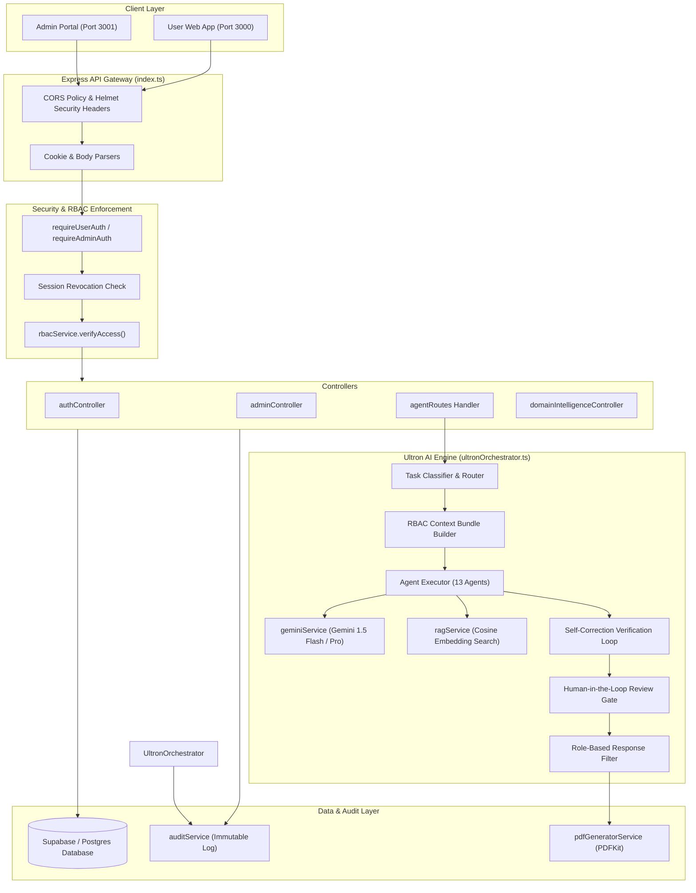
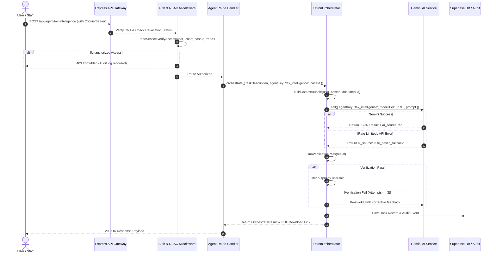
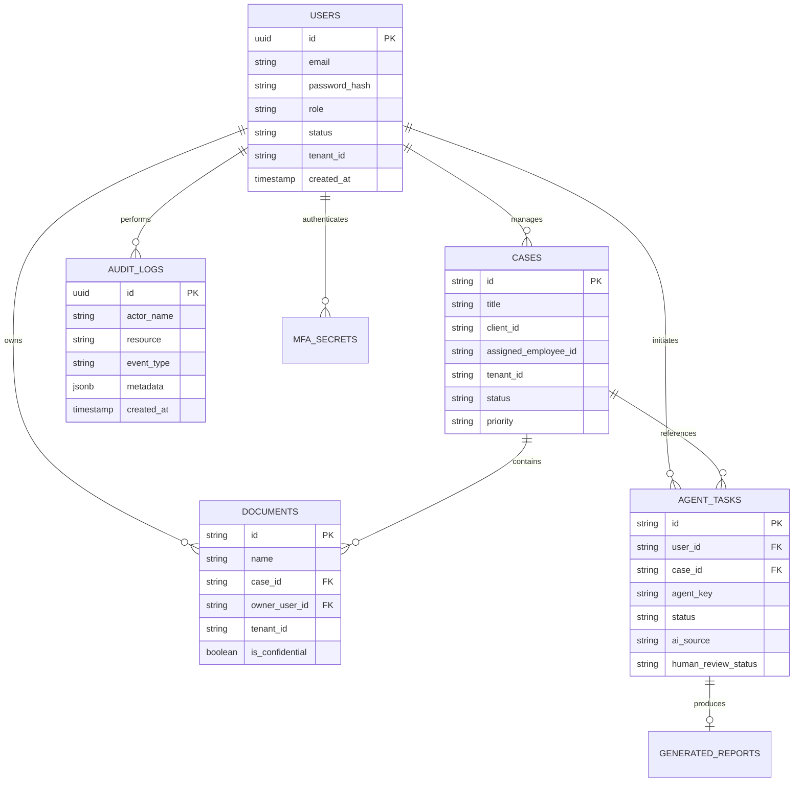

# NETFIX AI — Backend Architecture & AI Engine Specifications

This document outlines the detailed architecture, security middleware flow, database model relationships, and AI Orchestration loop in the **NETFIX AI Backend**.

---

## 🏛️ Comprehensive Architecture Diagram

---

## 🔑 Request & Response Lifecycle Flow

---

## 🗄️ Database Schema ERD

